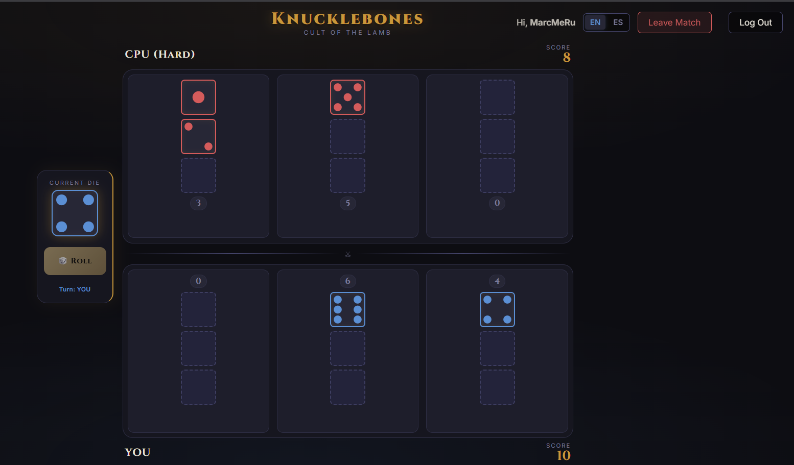

<div align="center">

  # 🎲 Knucklebones

  *A high-fidelity web implementation of the Cult of the Lamb minigame.*

  
  
  
  
  

  **[🕹️ Play Live Demo](https://marcmeru.dev/Knucklebones/) • [🐛 Report Bug](https://github.com/marcmeru11/Knucklebones/issues) • [💡 Request Feature](https://github.com/marcmeru11/Knucklebones/issues)**

</div>

---

**Knucklebones** is a high-fidelity web implementation of the popular minigame from *Cult of the Lamb*. It is a strategic dice-rolling game that blends luck with tactical placement, offering a polished, dark-themed aesthetic and multiple ways to play.

<details>
  <summary>Table of Contents</summary>
  <ol>
    <li><a href="#-gameplay-preview">Gameplay Preview</a></li>
    <li><a href="#-how-to-play">How to Play</a></li>
    <li><a href="#-features">Features</a></li>
    <li><a href="#-tech-stack">Tech Stack</a></li>
    <li><a href="#-getting-started">Getting Started</a></li>
    <li><a href="#-credits">Credits</a></li>
  </ol>
</details>

## Gameplay Preview




## How to Play

The objective is simple: **achieve a higher score than your opponent**. The game ends immediately as soon as one player completely fills their 3x3 grid.

> [!TIP]
> You can use "Spacebar" to roll the dice and "1", "2", or "3" to place the die in the corresponding column.


### Core Mechanics

1. **Roll the Die:** On your turn, roll a standard 6-sided die.
2. **Place your Die:** Choose one of the three columns on your board to place the die.
3. **Destroy Opponent Dice:** Placing a die in a column will **destroy** all dice of that exact same value in your opponent's corresponding column. Use this tactically to sabotage their score!

### The Multipliers
If you place a die in a column that already contains a die of the same value, their scores are multiplied:

| Combination | Math | Example (Rolling a 4) | Total Score |
| :--- | :--- | :--- | :--- |
| **Single** | `Value` | `4` | **4** |
| **Double** | `(Value + Value) x 2` | `(4 + 4) x 2` | **16** |
| **Triple** | `(Value + Value + Value) x 3` | `(4 + 4 + 4) x 3` | **36** |

## Features

- **Single Player:** Battle against a smart AI with multiple difficulty levels (Easy, Medium, Hard).
- **Local PvP:** Play against a friend on the same device.
- **Online Multiplayer:** Powered by **Firebase**, join or create private rooms to play globally in real-time.
- **Modern & Premium UI:** - Dark-mode design with crimson glowing accents.
  - Smooth glassmorphism effects and dynamic score calculations.
  - Interactive micro-animations for dice rolls and button hovers.
- **Multilingual Support:** Fully localized in **English** and **Spanish**.

## Tech Stack

This project is built to be lightweight and fast, without relying on heavy frontend frameworks.

- **Frontend:** Vanilla HTML5, CSS3 (CSS Variables, Grid, Flexbox), and JavaScript (ES6+).
- **Backend/Database:** Firebase Authentication & Firebase Realtime Database.
- **Assets:** Custom SVG icons for a crisp, consistent visual identity.

## Getting Started

Since this is a vanilla JavaScript project, no complex `npm` installation is required to run the local modes.

### Local Setup
1. Clone the repository:
   ```bash
   git clone [https://github.com/marcmeru11/Knucklebones.git](https://github.com/marcmeru11/Knucklebones.git)

2. Navigate to the project folder:
   ```bash
   cd Knucklebones
   ```
3. Open `index.html` in your favorite web browser, or use an extension like VS Code's *Live Server*.

> [!IMPORTANT]
> Firebase authentication is enabled by default. If you are forking this repo to deploy your own version, you will need to change the code to use your own Firebase project.

### Firebase Configuration (For Online Multiplayer and authentication)
If you are forking this repo to deploy your own version, you will need your own Firebase project:
1. Create a project in [Firebase](https://firebase.google.com/).
2. Enable **Realtime Database** and **Anonymous Authentication**.
3. Copy your config object and update the settings inside `src/js/FirebaseService.js` (or your config file).

> [!WARNING]
> Fierebase Realtime Database rules are highly recommended to be updated to prevent unauthorized access to your database.